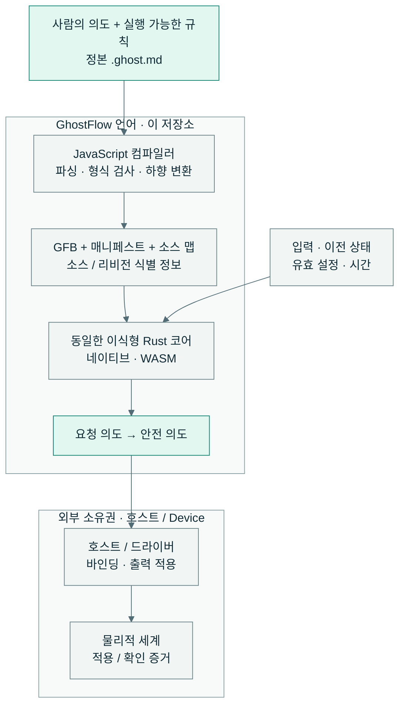

<!-- translation-source: README.md -->
<p align="center">
  
</p>

<div align="center">

# 의도를 잃지 않는 제어.

</div>

<p align="center">사람의 의도, 실행 가능한 규칙, 설명 가능한 판단을 하나의 읽기 쉬운 소스에 담는 제어 언어입니다.</p>

[English](README.md) · **한국어**

<p align="center">
  <a href="https://github.com/callin2/ghostflow-language/actions/workflows/verified-wasm.yml"></a>
  · <a href="LICENSE">MIT License</a>
</p>

## 우리의 비전

과정을 이해하는 사람이 원하는 동작을 설명하고, 동작을 확인하고, 왜 그렇게
작동했는지 이해할 수 있어야 합니다. 물 주기 시스템부터 더 넓은 자동화까지,
제어 프로그램의 전체 수명 동안 그 이해를 유지하는 것이 우리의 비전입니다.

GhostFlow는 사람이 읽을 수 있는 **`.ghost.md` 문서**에서 시작합니다.
의도, 설명, 실행 가능한 규칙을 함께 둡니다. 컴파일된 코드, 다이어그램,
추적 기록은 이 소스에서 파생되는 뷰입니다. AI는 후보 문서 작성을 도울 수 있습니다.
컴파일러는 프로그램을 검증합니다. 런타임은 **LLM 없이** 프로그램을 실행합니다.

<table>
  <tr>
    <td width="33%" valign="top">
      <br>
      <strong>의도 보존</strong><br>
      규칙 옆에서 이유를 읽습니다. 확인된 의도와 가정을 구분합니다.
    </td>
    <td width="33%" valign="top">
      <br>
      <strong>판단 재현</strong><br>
      동일한 입력, 이전 상태, 유효 설정, 시간으로 판단을 다시 살펴봅니다.
    </td>
    <td width="33%" valign="top">
      <br>
      <strong>근거 추적</strong><br>
      소스 맵과 실행 증거를 따라 문서와 그 리비전으로 돌아갑니다.
    </td>
  </tr>
</table>

**소스에서 확인하기:** [시작/정지 래치](examples/tutorial/01-latch.ghost.md)는
익숙한 제어 규칙을 리터레이트 문서에 담습니다.
[언어 철학](docs/LANGUAGE-REFERENCE.md)에서 그 설계 근거를 읽을 수 있습니다.

## 하나의 소스. 하나의 실행 코어.

JavaScript가 정본 문서를 파싱하고, 형식을 검사하고, 하향 변환합니다.
동일한 이식형 Rust 코어가 네이티브와 WASM 대상에서 컴파일된 GFB를 실행합니다.



언어는 요청 의도와 안전 의도를 계산합니다. 호스트와 드라이버가 물리적 효과를
적용합니다. **의도가 있다는 것은 릴레이가 움직였다는 확인이 아닙니다.**
재현 실행은 가상 판단을 확인합니다. 물리적 확인에는 별도의 장치 증거가 필요합니다.

API는 LLM을 통한 작성, 설치 맥락, 소스 저장, 배포 조정을 담당합니다.
프런트엔드는 상호작용과 시각화를 담당합니다. Device 펌웨어는 보드 매핑과
물리적 I/O를 담당합니다. 이 모듈들은 별도로 빌드하고 릴리스합니다.
[구현 경계](docs/IMPLEMENTATION.ko.md)와
[도구 체인 아키텍처](docs/LLM-TOOLCHAIN-ARCHITECTURE.ko.md)를 참조하세요.

## 로컬에서 실행하기

**Node.js 22 이상**, npm, Cargo 잠금 파일 v4를 지원하는 Rust가 필요합니다.
유지되는 튜토리얼은 macOS 또는 Linux에서 실행합니다. 설정 중 의존성을 내려받을 수 있습니다.

```sh
npm ci --ignore-scripts
rustup component add rustfmt
rustup target add wasm32-unknown-unknown
npm test
```

그다음 물 주기 예제를 컴파일하고 실행합니다.

```sh
npm run compile:example
npm run tutorial
```

`npm test`는 호스트 도구 체인을 검증하고 `build/verification.json`과 고유 실행
기록을 씁니다. 테스트 전에 Rust 픽스처를 생성하고 네이티브/WASM 러너를 빌드합니다.
Cargo 게이트는 `--locked --offline`과 로컬 `target/`을 사용합니다.
호스트 결과는 물리적 I/O 동작을 입증하지 않습니다.

## 학습과 탐색

| 시작점 | 내용 |
| --- | --- |
| [언어 참조](docs/LANGUAGE-REFERENCE.md) | 철학, 문법, 의미, 기능의 근거 |
| [튜토리얼](docs/TUTORIAL.ko.md) · [정본 예제](examples/) | 읽고 실행할 수 있는 제어 규칙 |
| [코딩 FAQ](docs/language_faq.md) | 작업 중심 프로그래밍 안내 |
| [참조 기능 상태](docs/REFERENCE-FEATURE-STATUS.md) | 현재 성숙도, 소유권, 실행 증거 |
| [English / 한국어 문서](docs/DOCUMENTATION.ko.md) | 이중 언어 문서 목록 |

## 현재 범위와 기여

GhostFlow는 **1.0 이전** 단계입니다. 참조 문서는 구현된 의미와 미래 설계를
함께 담습니다. 현재 수용 증거는 기능 상태와 [검증 안내](docs/VERIFICATION.ko.md)에서
확인하세요.

<details>
<summary><strong>컴파일러 진입점, 패키지, 집중 검사</strong></summary>

- `tools/browser-toolchain.mjs`는 Node I/O 없이 브라우저/Worker에 컴파일러를
  제공합니다. `tools/toolchain.mjs`는 같은 컴파일러를 감싸 Node 아티팩트 I/O를
  담당합니다. 두 진입점 모두 완전한 정본 `.ghost.md` 문서와 변경 불가능한 소스 식별 정보를 받습니다.
- `tools/portable-package.mjs`는 소스, GFB, 매니페스트, 소스 맵, 호스트 호환성
  식별 정보를 보존하는 서명된 패키지를 만듭니다. 브라우저와 Device 소비자는 같은
  검증기 계약을 사용합니다. [Portable GFB package v1](docs/PORTABLE-PACKAGE.ko.md)을 참조하세요.
- `crates/ghostflow-core`는 실행, 신호, 스테이션 중재를 담당합니다.
  `runtimes/wasm`과 `runtimes/node/ledger.mjs`는 참조 호스트 어댑터입니다.
  생성 아티팩트는 파생 뷰입니다. 인접한 과거 `.ghost` 파일은 비실행 증거이며
  지원하는 소스 입력이 아닙니다.
- `npm run test:compiler`는 WASM 빌드 없이 컴파일러 동작을 확인합니다.
  `npm run test:node`는 이미 빌드된 WASM 아티팩트를 사용해 부분 호스트 증거를
  기록합니다. `npm run test:contract`는 통합 식별/증거 계약을 확인합니다.
  부분 검사는 `npm test`를 대체하지 않습니다.
- 릴리스 소비자는 정확한 소스/바이트코드/매니페스트 해시, 컴파일러/코어 리비전,
  지원 프로파일/ABI를 보존합니다. 이 체크아웃에는 이전 빌드 증거, 펌웨어,
  라이브 모델 연결기, 사이트 데이터, 비공개 채팅 기록이 포함되지 않습니다.

</details>

[개발 작업 흐름](docs/DEVELOPMENT-WORKFLOW.ko.md)과
[저장소 소유권 규칙](AGENTS.ko.md)을 따르세요. 영어와 한국어 문서를 함께 유지하세요.
기존 자동화는 번역 최신성, 실행 코드 블록의 일치, 문서 인덱스를 확인합니다.
문서 편집 묶음이 끝나면 `npm run docs:index`와 `npm run docs:check`를 순서대로 실행하세요.
실행 가능한 FAQ 및 프로그래밍 예제는 컴파일러와 호스트 게이트에서
`tests/docs-runnable-examples.test.mjs`로도 검사합니다.

[MIT License](LICENSE)로 배포됩니다.
