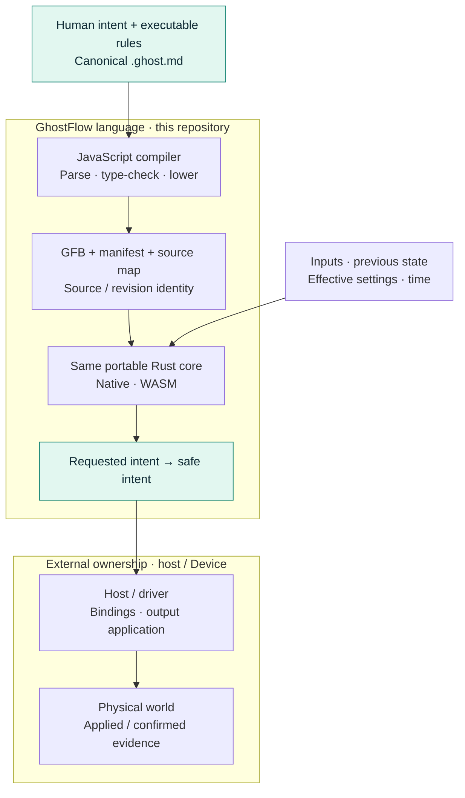

<p align="center">
  
</p>

<div align="center">

# Control that stays true to intent.

</div>

<p align="center">A control language that brings human intent, executable rules, and explainable decisions into one readable source.</p>

**English** · [한국어](README.ko.md)

<p align="center">
  <a href="https://github.com/callin2/ghostflow-language/actions/workflows/verified-wasm.yml"></a>
  · <a href="LICENSE">MIT License</a>
</p>

## Our vision

People who understand a process should be able to describe how it ought to work,
check its behavior, and understand why it acted. From a watering system to wider
automation, our vision is to keep that understanding present throughout the life
of the control program.

GhostFlow starts with a human-readable **`.ghost.md` document**. Intent,
explanation, and executable rules live together. Compiled code, diagrams, and
traces are derived views of that source. AI may help write a candidate document.
The compiler validates the program; the runtime executes it **without an LLM**.

<table>
  <tr>
    <td width="33%" valign="top">
      <br>
      <strong>Intent preserved</strong><br>
      Read the reason beside the rule. Keep confirmed intent distinct from assumptions.
    </td>
    <td width="33%" valign="top">
      <br>
      <strong>Decisions replayable</strong><br>
      Revisit a decision with the same inputs, previous state, effective settings, and time.
    </td>
    <td width="33%" valign="top">
      <br>
      <strong>Reasons traceable</strong><br>
      Follow source maps and execution evidence back to the document and its revision.
    </td>
  </tr>
</table>

**See the idea in source:** [a start/stop latch](examples/tutorial/01-latch.ghost.md)
puts a familiar control rule in a literate document.
[The language philosophy](docs/LANGUAGE-REFERENCE.en.md#design-philosophy)
explains the design behind it.

## One source. One execution core.

JavaScript parses, type-checks, and lowers the canonical document. The same
portable Rust core executes the compiled GFB on native and WASM targets.



The language computes requested and safe intents. The host and driver apply
physical effects. **An intent is not confirmation that a relay moved.** Replay
checks virtual decisions; physical confirmation needs separate device evidence.

The API owns LLM authoring, installation context, source storage, and deployment
orchestration. The frontend owns interaction and visualization. Device firmware
owns board mappings and physical I/O. These modules build and release separately.
See [implementation boundaries](docs/IMPLEMENTATION.md) and
[the toolchain architecture](docs/LLM-TOOLCHAIN-ARCHITECTURE.md).

## Try it locally

Use **Node.js 22+**, npm, and Rust with Cargo lockfile v4 support. The retained
tutorial runs on macOS or Linux. Setup may download dependencies.

```sh
npm ci --ignore-scripts
rustup component add rustfmt
rustup target add wasm32-unknown-unknown
npm test
```

Then compile and run the watering example:

```sh
npm run compile:example
npm run tutorial
```

`npm test` verifies the host toolchain and writes `build/verification.json` plus
a unique run record. It generates the Rust fixture before testing, then builds
the native/WASM runners. Cargo gates use `--locked --offline` and local `target/`.
Host results do not establish physical I/O behavior.

## Learn & explore

| Start here | What you will find |
| --- | --- |
| [Language Reference](docs/LANGUAGE-REFERENCE.en.md) | Philosophy, syntax, semantics, and feature rationale |
| [Tutorial](docs/TUTORIAL.md) · [canonical examples](examples/) | Control rules you can read and run |
| [Coding FAQ](docs/language_faq.en.md) | Task-oriented programming guidance |
| [Reference feature status](docs/REFERENCE-FEATURE-STATUS.md) | Current maturity, ownership, and executable evidence |
| [English / 한국어 documentation](docs/DOCUMENTATION.md) | The bilingual document catalog |

## Current scope & contributing

GhostFlow is **pre-1.0**. The reference includes implemented semantics and future
design. Use the feature status and [verification guide](docs/VERIFICATION.md) to
check what has acceptance evidence today.

<details>
<summary><strong>Compiler entry points, packages, and focused checks</strong></summary>

- `tools/browser-toolchain.mjs` exposes the compiler for browsers/Workers without
  Node I/O. `tools/toolchain.mjs` wraps the same compiler for Node artifact I/O.
  Both accept the complete canonical `.ghost.md` document and immutable source identity.
- `tools/portable-package.mjs` produces a signed package preserving source, GFB,
  manifest, source map, and host-compatibility identity. Browser and Device
  consumers share the verifier contract. See [Portable GFB package v1](docs/PORTABLE-PACKAGE.md).
- `crates/ghostflow-core` owns execution, signals, and station arbitration.
  `runtimes/wasm` and `runtimes/node/ledger.mjs` are reference host adapters.
  Generated artifacts are projections. Historical adjacent `.ghost` files are
  non-executable evidence, not supported source inputs.
- `npm run test:compiler` checks compiler behavior without building WASM.
  `npm run test:node` uses an already-built WASM artifact and records partial host
  evidence. `npm run test:contract` checks integration identity/evidence contracts.
  Partial checks do not replace `npm test`.
- Release consumers preserve exact source/bytecode/manifest hashes, compiler/core
  revision, and supported profile/ABI. This checkout carries no prior build
  evidence, firmware, live model connector, site data, or private chat archive.

</details>

Follow the [development workflow](docs/DEVELOPMENT-WORKFLOW.md) and
[repository ownership rules](AGENTS.md). Keep English and Korean documentation
together. Existing automation checks translation freshness, executable-fence
parity, and document indexes: run `npm run docs:index`, then `npm run docs:check`
after a documentation batch. Runnable FAQ and programming samples are also
checked by `tests/docs-runnable-examples.test.mjs` in the compiler and host gates.

Released under the [MIT License](LICENSE).
