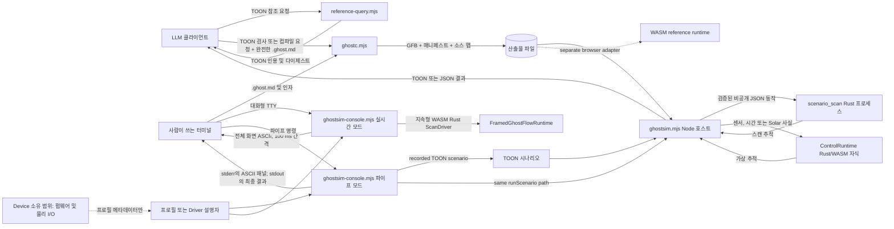
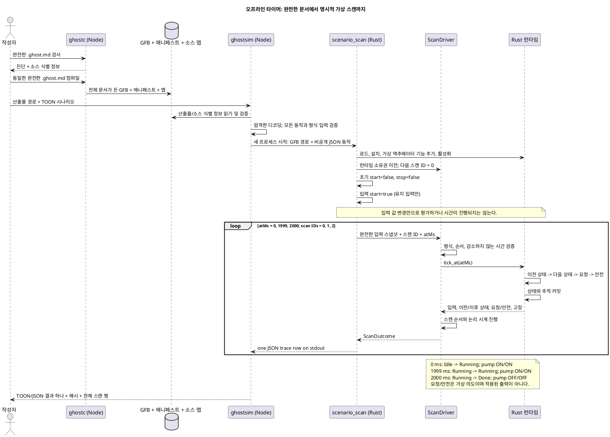
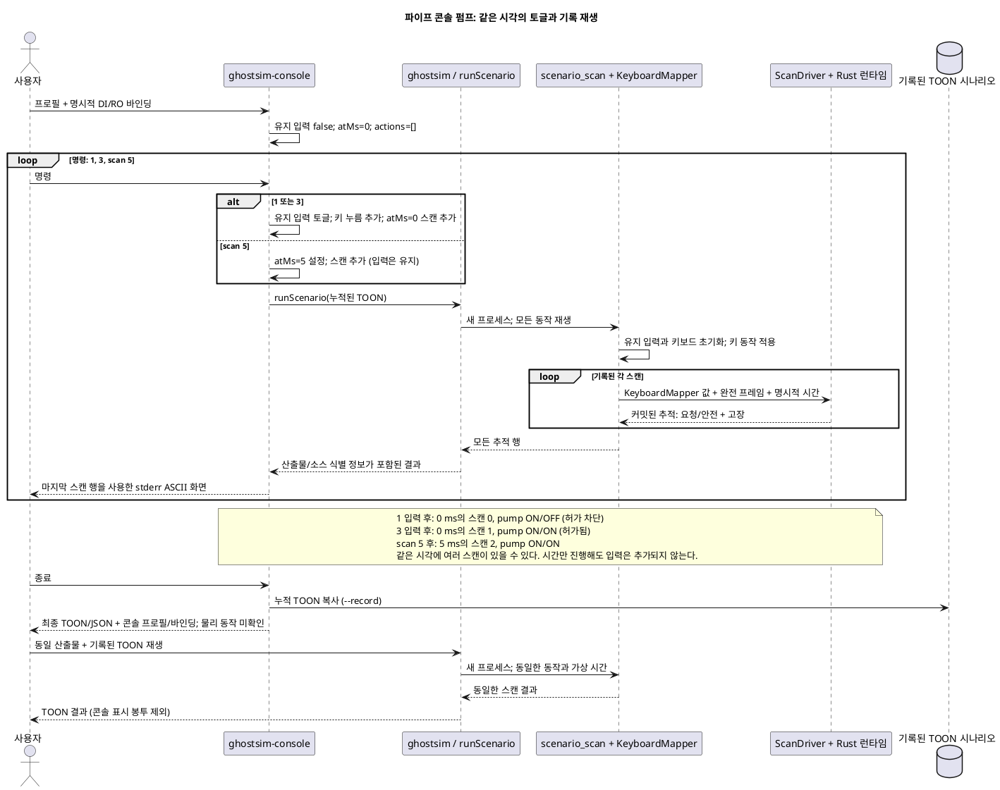
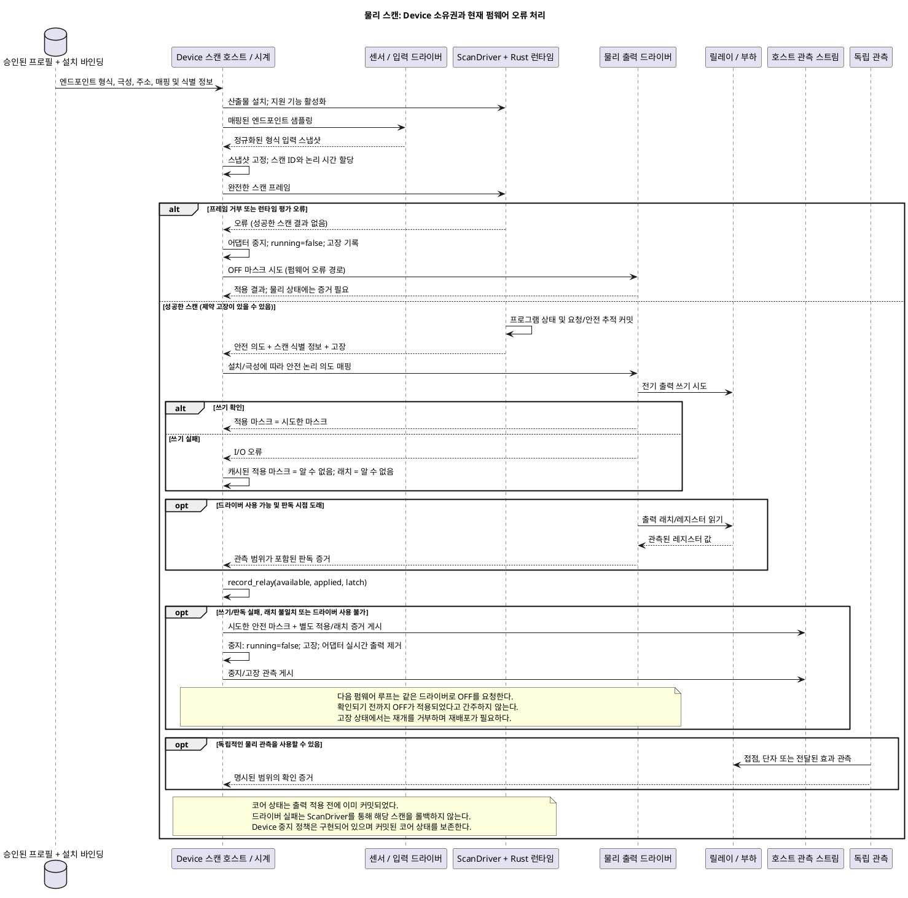

<!-- translation-source: docs/LLM-TOOLCHAIN-ARCHITECTURE.md -->
[English original](LLM-TOOLCHAIN-ARCHITECTURE.md)

# 작성 및 가상 시뮬레이션 아키텍처

이 문서는 현재 체크아웃의 오프라인 도구체인을 설명한다. 표준 프로그램은
완전한 `.ghost.md` 문서 하나다. 설명, 의도 앵커, 문서 ID와 개정 ID는 컴파일된
산출물과 함께 전달되며 별도의 편집 가능한 제어 문자열을 만들지 않는다.
[언어 참조](LANGUAGE-REFERENCE.md)는 프로그램 의미를 정의한다. 이 문서는
현재 도구와 경계를 설명한다.



모델 경로는 [참조 질의](../tools/reference-query.mjs),
[`GhostFlow/cli-request-v1` 및 `cli-result-v1`](../tools/ghostc.mjs),
[`GhostFlow/scenario-v1` 및 `scenario-result-v1`](../tools/ghostsim.mjs)에 엄격한
TOON을 사용한다. `ghostc --request`는 소스 범위를 포함한 형식화 진단을 반환한다.
사람이 쓰는 `ghostc` 명령은 문서 경로를 직접 받고 짧은 텍스트 진단을 출력한다.
[ASCII 콘솔](KEYBOARD-HOST.md)은 두 모드로 동작한다. 대화형 TTY 모드는 즉시
스캔을 시작하고, 지속형 Rust WASM 런타임과 ScanDriver 하나를 사용해 벽시계 기준
100 ms 간격으로 스캔한다. 숫자 키 1–8은 Bool 입력을 토글하고 즉시 스캔한다.
`:toggle CHANNEL`도 사용할 수 있다. 파이프 모드는 결정적인 한 줄 명령을 받아
기존 시나리오 실행기를 수행하고 재생 가능한 TOON 시나리오를 기록할 수 있다.

소스 맵은 완전한 문서와 변경 불가능한 문서/개정 식별자를 보관한다. `ghostsim`은
실행 전에 맵을 정확한 GFB 바이트 및 매니페스트와 대조한다. 결과에는 시나리오
SHA-256, 바이트코드 SHA-256, 소스 문서 SHA-256과 파일 이름이 표시되며, 제공된
경우 문서/개정 ID도 포함된다. 요청이 잘못되었거나 활성화가 실패하면 스캔 행이
없는 거부 결과를 반환한다. 런타임 오류는 앞서 커밋된 스캔과 오류 동작 인덱스만
반환한다. 실행기 호출 뒤 호스트가 실패하면 `traceComplete: false`인 `host-error`를
보고한다. 이때 빈 스캔 목록은 자식 프로세스 관측을 사용할 수 없다는 뜻이지,
런타임이 스캔하지 않았다는 뜻이 아니다. 모든 실패는 0이 아닌 종료 코드로 끝난다.

시나리오 결과는 결정적 재생 산출물이지 실시간 관측 기록이 아니다. `scanId`는
해당 재생에만 유효하며 `runId`는 없다. 스캔을 관측값으로 게시하는 호스트는 자체
실행 식별자를 부여하고 산출물, 소스, 시나리오와 스캔 식별자를 함께 보존해야
한다. 이는 [참조 §5.4](reference/05-settings-and-observation.md#54-정체성과-물리적-사실의-경계)의 요구사항이다.

프로그램을 평가하는 것은 `scan` 동작뿐이다. 음수가 아닌 `atMs`는 되돌아갈 수
없는 가상 시각이다. 입력 및 키 동작은 유지되는 값을 갱신하며, 나중에 시각만
지정한 스캔을 하면 그 값으로 다시 평가한다. Rust 코어는 요청된 가상 의도와
안전한 가상 의도를 별도로 만든다. 어느 쪽도 릴레이가 움직였다는 뜻은 아니다.
일반 입력 시나리오는 네이티브 Rust 프로세스에 비공개 JSON 전송을 사용한다.
센서, 인증된 구간 및 Solar 시나리오는 명시적 관측과 활성화 프로필을 사용하는
기존 Rust/WASM `ControlRuntime` 자식 프로세스를 사용한다. 두 경로 모두 이식
가능한 Rust 코어를 실행하며 전송 방식은 별도의 소스 언어가 아니다. 창, 센서 및
적응 사례는 프레임 스캔을 사용한다. 인증된 구간 및 Solar 사례는 호스트가 재생
내 스캔 ID를 부여하는 기존 레거시 WASM 진입점을 사용한다. 타이머 시간은 단조
증가하는 `atMs`로 제공한다. 벽시계, 달력 및 Solar 공급자 사실은 오프라인 RTC나
선택적 NTP 보정에서 오더라도 호스트 바인딩의 책임이다. 언어의 시간 의미는
그 출처에 따라 바뀌지 않는다.
파이프 콘솔 모드는 TOON 시나리오 하나를 누적하고 명령을 다시 그릴 때마다 같은
`runScenario` 경로로 재생한다. 명시적 가상 시간을 사용하며 백그라운드 시계는 없다.
완료된 스캔 뒤 파이프 명령이나 스캔 시간이 실패하면 `command-error`가 기존 행을
보존하고 `--record`는 승인된 재생 가능 접두부만 저장한다. 대화형 TTY 모드는
별도다. 활성화된 지속형 Rust WASM `FramedGhostFlowRuntime`/`ScanDriver` 하나를
소유하고, 시작 시와 100 ms마다 스캔하며 경과한 벽시계 시간을 감소하지 않는 가상
논리 시간으로 제공한다. 키 토글도 즉시 스캔을 일으킨다. 화면 기록은 스캔 120개로
제한되며 화면 갱신 시 과거 동작을 재생하지 않는다. 두 모드 모두 가상 입력과
요청/안전 의도만 표시한다. 물리 출력을 적용하거나 하드웨어 상태를 확인하지 않는다.

선택한 [`GhostFlow/board-profile-v1`](KEYBOARD-HOST.md) 또는 표시 전용 Driver
설명자가 콘솔의 입력/출력 채널 순서를 제공한다. `--bind CHANNEL=port`는 각
채널을 매니페스트의 일치하는 논리 포트에 연결한다. 보드 프로필은 엔드포인트
이름에서 논리 바인딩을 추론하지 않는다. 설명자가 없으면 콘솔은 **가상 Waveshare
8DI/8RO** 배열을 사용한다. 이름이 정확히 일치하는 기본 `DI`/`RO` 논리 이름만
자동 바인딩한다. 이 배열은 핀, 설치된 보드, 설치 매핑 또는 적용된 출력을
검증하지 않는다. 다른 채널 수는 선택한 설명자에서 가져온다. 결과에는 프로필 ID,
있는 경우 개정, 다이제스트, 바인딩과 `physical: unconfirmed`가 기록된다.

[브라우저 안전 공개 도구체인](../tools/browser-toolchain.mjs)과 [WASM 어댑터](../runtimes/wasm/README.md)는
동일한 이식 가능 언어/런타임 의미로 가는 별도 호스트 경로다. API 호스트는 모델
요청, 대화, 문서 저장과 배포 오케스트레이션을 소유한다. Device 저장소는 보드
프로필, 펌웨어, 실제 드라이버, 핀, 시계와 물리 검증을 소유한다. 이 CLI는 모델
호출도 장치 호출도 하지 않는다.

## Driver, 런타임 및 가상 장치의 책임

다음 구성 요소는 오프라인 경로에 구현되어 있다. **Driver**라는 말에는 한정어가
필요하다. 입력 어댑터, 코어 `ScanDriver`, 콘솔 설명자와 물리 I/O 드라이버는
서로 다른 책임을 가진다.

| 구성 요소 | 책임과 상태 | 구현 |
| --- | --- | --- |
| 시나리오/키보드 입력 드라이버 | 형식이 지정된 논리 입력과 키 누름/뗌 상태를 유지한다. 명시적 동작을 완전한 입력 스냅샷으로 변환한다. 출력에서 새 센서 값을 유도하지 않는다. | [`scenario_scan.rs`](../crates/ghostflow-core/examples/scenario_scan.rs), [`KeyboardMapper`](../crates/ghostflow-core/src/keyboard.rs) |
| 파이프 가상 시간 호스트 | `atMs`와 명시적 스캔 기회를 제공한다. 토글 명령은 입력/키 동작과 현재 시각의 스캔을 추가한다. `scan N`은 지정된 시각으로 진행한다. 백그라운드 시계는 세션을 진행시키지 않는다. | [`ghostsim.mjs`](../tools/ghostsim.mjs), [`ghostsim-console.mjs`](../tools/ghostsim-console.mjs) |
| 센서/공급자 시나리오 호스트 | 명시적 센서 샘플을 조정하고 인증된 Bool 구간을 수용하며 Solar 시계/공급자 사실을 제공한다. 명시적 활성화 프로필을 사용하고 RTC/NTP나 물리 센서를 직접 읽지 않는다. | [`scenario-sensors.mjs`](../tools/scenario-sensors.mjs), [`ControlRuntime`](../runtimes/wasm/control-runtime.mjs) |
| 대화형 TTY 호스트 | 지속형 WASM `FramedGhostFlowRuntime`/Rust `ScanDriver` 하나를 소유한다. 경과 벽시계를 사용해 즉시 및 100 ms마다 스캔하고 입력 토글 뒤에도 즉시 스캔한다. 표시 기록은 120개 스캔으로 제한된다. 장치 I/O는 없다. | [`ghostsim-live.mjs`](../tools/ghostsim-live.mjs), [`ghostsim-console.mjs`](../tools/ghostsim-console.mjs) |
| 프레임 스캔 드라이버 | 런타임 하나를 소유하고 평가 전에 완전한 형식 입력, 순차 스캔 ID, 감소하지 않는 논리 시간을 검증한다. 성공 스캔은 순서/시간을 진행시킨다. 장치 I/O는 하지 않는다. | [`ScanDriver`](../crates/ghostflow-core/src/scan.rs) |
| 이식 가능한 Rust 런타임 | GFB를 로드하고 지원 기능을 활성화하며 표현식, 프로그램 상태, 타이머와 제약을 평가한다. 요청/안전 의도 및 고장이 담긴 추적을 출력한다. 네이티브와 WASM 호스트가 이 코어를 사용한다. | [`ghostflow-core`](../crates/ghostflow-core/src/lib.rs), [WASM 어댑터](../runtimes/wasm/README.md) |
| 가상 장치 화면 | 선택된 채널 목록으로 유지 중인 입력, 요청/안전 출력 뱅크와 스캔 식별자를 표시한다. 상태는 시뮬레이션 입력 값, 코어 프로그램 상태와 기록된 관측으로 구성된다. 별도 액추에이터나 플랜트 모델은 없다. | [ASCII 패널 및 프로필 규칙](KEYBOARD-HOST.md) |
| 프로필/Driver 설명자 | 순서가 있는 채널과 형식을 설명한다. 명시적 바인딩은 이를 매니페스트 포트에 연결한다. 보드 프로필의 드라이버/주소/극성 메타데이터는 콘솔에서 실행되지 않는다. | [`board-profile-v1` 계약](../contracts/integration-v1/README.md), [`console-profile-v1`](KEYBOARD-HOST.md) |

여기서 “가상 장치”는 실제 GhostFlow 런타임을 둘러싼 I/O 화면을 뜻한다. 네이티브
실행기는 모듈 출력 형식에서 가상 액추에이터 기능을 등록하여 런타임을 활성화한다.
Waveshare 컨트롤러, 릴레이 레지스터, 접점, 펌프, 수위 또는 센서 응답을 에뮬레이션하지
않는다. 특히 `safe.pump = true`가 수위 입력을 자동으로 바꾸지 않는다. 시나리오가
그 입력을 명시적으로 제공해야 한다. 폐루프 플랜트 모델이나 적용/확인된 출력의
시뮬레이션에는 별도의 명시적 모델과 증거 계약이 필요하며, 이 CLI에는 둘 다 없다.

브라우저는 자체 입력 및 재생 속도 호스트를 가진다. Farm Studio의
`app/src/features/playground/playgroundRuntime.ts`는
`ControlRuntime.instantiateFramed`를 인스턴스화한다. `playgroundScan.ts`는
매니페스트 형태의 불리언 스냅샷과 명시적 논리 시간을 공급한 뒤 반환된 안전 뱅크에서
표시할 출력을 읽는다. `simulationPacer.ts`는 대화형 재생의 스캔 기회를 정한다.
이 프런트엔드 구성 요소는 GhostFlow 규칙을 평가하지 않는다. 브라우저 런타임 상태는
스캔 사이에 유지된다. 대화형 TTY 모드도 하나의 실시간 WASM 세션에서 런타임 상태를
보존한다. 파이프 콘솔 모드는 누적 시나리오를 새 네이티브 프로세스에서 재생해
상태를 재구성한다. 이전 실시간 Rust 키보드 예제는 별도 호스트다.

## 대표 실행 순서

### 컴파일하고 시작한 뒤 가상 타이머 경계에 도달

구현된 이 경로는 다음 완전 문서와
[`virtual-timer.ghost.md`](../examples/authoring/corpus/virtual-timer.ghost.md)
및 [시나리오](../examples/authoring/corpus/virtual-timer-scenario.toon)를 사용한다.
`phase`는 `Idle`에서 시작하고 `pump`은 계산된 다음 phase를 따른다. 세 스캔 사이에
벽시계 대기는 없다. 아래 phase 이름은 소스 의미를 설명하며, 추적에는 컴파일러가
생성한 타이머 상태도 들어 있다.




검증 또는 활성화가 실패하면 스캔 행이 나오지 않는다. 동작 수준의 런타임 오류는
실행을 멈추고 앞서 커밋된 행과 오류 동작 인덱스를 반환한다. 제약 고장은 안전
의도가 차단된 성공 스캔으로 나타날 수도 있으며 자동으로 실행기 실패가 되지는
않는다. 이 경로들은 다음 파일에 구현되어 있다.
[`ghostsim.mjs`](../tools/ghostsim.mjs),
[`scenario_scan.rs`](../crates/ghostflow-core/examples/scenario_scan.rs), 및
[`ScanDriver`](../crates/ghostflow-core/src/scan.rs).

### 파이프 모드: 입력 토글, 허가 차단 확인, 재생

이는 아래 재현 절의 파이프 콘솔 명령 순서다. `pump-rev-2.ghost.md`와 명시적
DI/RO 바인딩을 사용한다. 이 펌프에는 프로그램 상태나 타이머가 없다. 콘솔은 누적
시나리오를 소유한다. 각 `runScenario` 호출은 새 Rust 프로세스를 만들어 처음부터
런타임 상태를 재구성한다.




기록에는 논리 입력/키 동작과 가상 스캔 시간이 남는다. 프로필 다이제스트와 DI/RO
바인딩 목록은 시나리오 파일이 아니라 최종 콘솔 결과에 추가된다. 기록을 재생하면
논리 스캔이 재현된다. 패널까지 재현하려면 프로필과 바인딩 인자도 보존해야 한다.

## 물리 Driver와 Device 경계

물리 경로에는 다음 문서에서 정의한 추가 책임이 있다.
[참조 §8](reference/08-language-runtime-and-device-boundaries.md) 및
[통합 계약](../contracts/integration-v1/README.md)에 정의되어 있다.




이 다이어그램은 소유 계약과 현재 `farm-device` 펌웨어 오류 경로를 함께 나타낸다.
이는 `ghostsim` 연결이나 하드웨어 검증이 아니다. 독립적인 물리 확인은 계약 경계다.
현재 펌웨어 관측은 의도, 적용 쓰기와 레지스터 래치만 보고하며 릴레이 접점이나
부하 피드백은 없다. Device는 펌웨어, 물리 드라이버, 승인된 보드 프로필, 시계,
워치독과 부팅/오류 시 출력 처리를 소유한다. 설치 바인딩은 각 논리 포트의 실제
엔드포인트를 선택한다. 논리 안전 의도, 드라이버가 적용한
출력, 레지스터 판독값과 물리 확인은 서로 다른 증거로 유지된다. 통합 검증기는
제공된 식별자와 매핑을 검사하지만 이를 설치하거나 I/O를 수행하지 않는다.

Device 어댑터 코드는 `farm-device`에 별도로 있다.
`rust/ghostflow-adapter/src/lib.rs`는 공유 `ScanDriver`를 사용하고 `record_relay`로
적용 마스크와 릴레이 래치 관측을 기록한다. 실제 출력 동작은 펌웨어가 소유한다.
이 작성 경로는 별도 구현을 호출하거나 인증하지 않는다. 배포 전 해당 펌웨어/코어
개정, 설치 매핑과 물리 증거를 확인해야 한다. 아래 명령에는 종단 간 장치 배포,
하드웨어 에뮬레이션 또는 물리 확인 단계가 없다.

출력 증거 사슬은 이미 다음에서 정의한다.
[Reference §4.7](reference/04-sensors-constraints-control.md#47-requested-safe-applied-confirmed):
요청 의도, 안전 의도, 적용 명령과 확인된 피드백은 서로 다른 사실이다.
[명령 결과 수명 주기](reference/05-settings-and-observation.md#event-command-result와-alarm)는
요청 수신, 거부, 시작, 완료, 취소와 실패를 설명한다. 코어 스캔이 완료되었다고
물리 동작도 완료되었다고 입증하지 않는다. [Interaction v0 계약](../contracts/interaction-v0/README.md)은
완료된 런타임 관측을 투영하며 I/O를 수행하지 않는다. 참조 문서
[§8.5](reference/08-language-runtime-and-device-boundaries.md#85-변경과-재시작의-생명주기)
는 재시작/상태 복원을 명시적 정책과 체크포인트 계약에 별도로 맡긴다. I/O 실패
뒤 성공한 코어 스캔을 롤백하도록 요구하지 않는다.

현재 Device 정책은 `farm-device/rust/firmware/src/ghostflow.rs`
(`scan_with_clock`, `set_mask`, `record_relay`, 그 다음 `halt`)와
`farm-device/rust/ghostflow-adapter/src/lib.rs` (`halt`, `scan_inner`, `resume`)에서
볼 수 있다. 시도한 안전 마스크를 관측값으로 보존하고 이후 코어 평가를 중지하며,
어댑터의 실시간 출력 의도를 지우고 다음 펌웨어 루프에서 OFF를 요청한다. 커밋된
코어 상태는 보존하고 고장 상태에서는 재개를 거부한다. 이는 구현된 Device 정책이며
언어 트랜잭션이 누락된 것이 아니다.

이 평가는 깨끗한 `farm-device` 개정
[`6d2e97b`](https://github.com/callin2/farm-device/commit/6d2e97b243045e3b2dfbbb9bf205614e26eceba4),
및 `rust/ghostflow-adapter/tests/adapter.rs`의
`relay_fault_halts_clears_intent_and_trace_is_bounded` 사례를 확인했다. 문서 검토에서
테스트를 읽었지만 다시 실행하지는 않았다. 구현 여부를 다시 주장하기 전에 이후
Device 개정을 살펴야 한다. 호스트 테스트나 이 다이어그램 모두 실제 릴레이 접점이
OFF가 되었음을 입증하지 않는다.

## 실행 순서가 보여주는 점과 남은 질문

오프라인 소유 관계는 일관적이다. 호스트는 입력과 시간을 제공하고 Rust 코어는
평가와 상태를 소유하며 화면은 추적을 소비한다. 이 실행 순서만으로 배포 완료를
입증할 수 없다. 다음은 누락 동작이 필요한 시나리오를 기준으로 심각도를 매긴 검토 결과다.

| 검토 결과 | 영향 및 심각도 | 필요한 증거 또는 결정 |
| --- | --- | --- |
| 코어 커밋이 물리 출력 적용보다 먼저 일어나며 증거 단계는 별개다. | **정의된 경계이며 정책 누락이 아님:** 현재 Device 펌웨어는 적용 실패를 기록하고 중단한 뒤, 커밋된 코어 상태를 롤백하지 않고 다음 루프에서 OFF를 요청한다. | 대상 장치의 펌웨어 개정과 오류 경로를 확인한다. CLI 시뮬레이션은 출력 처리나 물리 OFF를 인증하지 않는다. |
| CLI에는 출력에서 센서로 이어지는 플랜트 모델이 없다. | **폐루프 주장에는 높음:** 안전한 펌프 의도만으로 물 흐름, 수위 변경 또는 센서 피드백을 입증할 수 없다. | 명시적 시나리오 입력이나 별도 플랜트 모델을 제공한다. 하드웨어 주장은 물리 효과를 독립적으로 관찰한다. |
| 파이프 콘솔은 누적 시나리오를 다시 재생하며 시나리오는 256개 스캔으로 제한된다. | **파이프 검토에는 낮음:** 이 모드는 결정적이고 제한되어 있다. | 명령 스크립트와 재생 가능한 기록에 사용한다. |
| 대화형 TTY는 벽시계 기준 100 ms 간격으로 스캔하며 화면 샘플 120개를 보관한다. | **호스트 시간 제한:** 스케줄러 지연이 실제 스캔 간격에 영향을 줄 수 있고 런타임 논리 시간은 경과 벽시계를 사용한다. | 이는 가상 검토 화면이지 마감 시간 보장이나 장치 호스트가 아니다. |
| 콘솔 기록에는 표시 프로필/바인딩이 없으며 최종 결과에만 있다. | **논리 재생에는 낮음, 패널 재현에는 중간:** 논리 스캔은 재현할 수 있지만 TOON만으로 원래 채널 이름/배치를 복구할 수 없다. | 패널 식별이 중요하면 기록과 함께 최종 콘솔 결과 및 프로필/바인딩 인자를 보존한다. |

펌프 허가 순서는 요청 의도와 안전 의도를 비교한다. 타이머 순서는 이전/다음
프로그램 상태와 1999/2000 ms 경계를 확인한다. 어느 쪽도 물리 마감 시간을 입증하지
않는다. 호스트가 2000 ms에 스캔을 제공하지 않으면 런타임은 그때 자율 전이를 하지
않는다. 실제 스캔 간격, 입력 최신성 및 출력 지연은 호스트/Device 승인 기준으로
남는다. Device 측 디버그/출력 정책은 다음에서 추적한다.
[farm-device #25](https://github.com/callin2/farm-device/issues/25); 물리 릴레이
접점 증거는 다음에서 추적한다.
[farm-device #26](https://github.com/callin2/farm-device/issues/26).

## 공개 경로 재현

언어 저장소 루트에서 의존성을 설치하고 네이티브 `scenario_scan` 예제를 빌드한 뒤
다음 명령을 실행한다. 검토된 예제 문서와 TOON 요청을 사용하며 원시 제어 사본은
생성하지 않는다.

```sh
mkdir -p build/authoring
cp examples/authoring/pump-rev-2.ghost.md build/authoring/pump.ghost.md
node tools/ghostc.mjs --request examples/authoring/check-rev-2.toon
node tools/ghostc.mjs --request examples/authoring/compile-rev-2.toon
node tools/ghostsim.mjs build/authoring/pump.gfb examples/authoring/pump-scenario.toon --format toon
printf '1\n3\nscan 5\nexit\n' | node tools/ghostsim-console.mjs build/authoring/pump.gfb \
  --bind DI1=start --bind DI2=stop --bind DI3=permit_ok \
  --bind RO1=pump --bind RO2=permit --record build/authoring/console.toon --format json
node tools/ghostsim.mjs build/authoring/pump.gfb build/authoring/console.toon --format toon
```

이 재현은 **파이프 결정 모드**를 실행한다. 검사/컴파일 결과는 문서 `GF-EXAMPLE-PUMP`,
개정 `rev-2`와 동일한 전체 문서 SHA-256을 식별한다. 스크립트 시나리오는 0, 1,
2 ms에 스캔한다. `pump` 요청/안전 값은 차례로 `ON/OFF`, `ON/ON`, `OFF/OFF`다.
콘솔 예제는 0, 0, 5 ms에 스캔한다. 패널에는 바인딩되지 않은 DI8/RO8을 포함한
입력/출력 행 8개가 있으며 물리 상태를 미확인으로 표시한다. 기록된 시나리오를
재생하면 같은 스캔과 산출물 식별자가 나온다. 선택한 2DI/4RO 보드 프로필 픽스처는
[`ghostsim-console.test.mjs`](../tests/ghostsim-console.test.mjs)에서 서로 다른 행 수를
검증한다. [`authoring-workflow.test.mjs`](../tests/authoring-workflow.test.mjs)는 TOON
검사/컴파일/시뮬레이션 경로를 이미 확인한다. 이 화면을 위해 별도 컴파일러나
실행기가 필요하지 않다.

## 현재 제한

실행기는 시나리오 텍스트 최대 256 KiB, 동작 1,024개, 스캔 256개, 인코딩 결과
1 MiB를 허용한다. 일반 런타임 활성화를 사용한다. 외부 인증 구간, 일정 바인딩 또는
다른 호스트 리소스가 필요한 제어는 활성화 때 거부된다. 호스트 이벤트 순서는
[#115](https://github.com/callin2/ghostflow-language/issues/115)에서 추적한다.
시간 리소스는 [TEMPORAL-RESOURCES.md](TEMPORAL-RESOURCES.md)에 설명되어 있다.
기본 가상 시간 시뮬레이션은 숨은 기본 정책을 제공하지 않는다. 파이프 콘솔 모드에는
자동 스캔 간격이 없다. 대화형 TTY 모드는 벽시계 기준 100 ms마다, 그리고 토글 직후
스캔한다. 두 모드 모두 물리 동작을 입증하지 않는다. 표시 출력은 요청/안전 가상
의도이며 물리 적용이나 확인은 없다.
