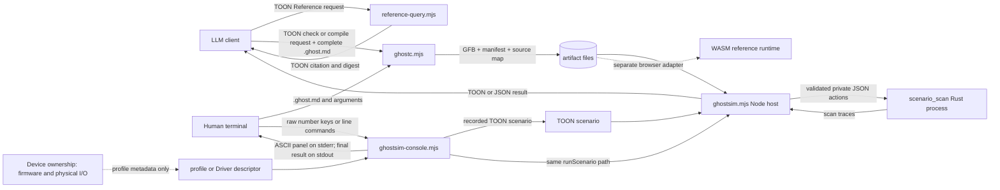
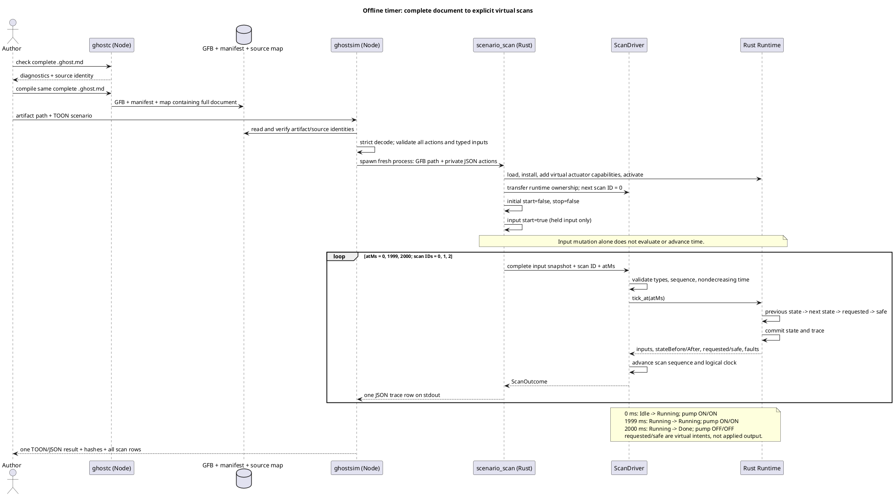
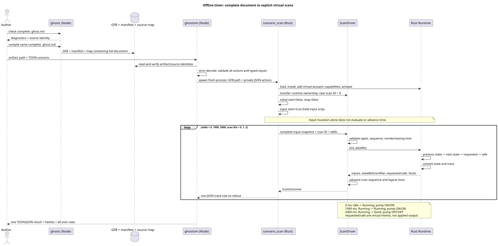
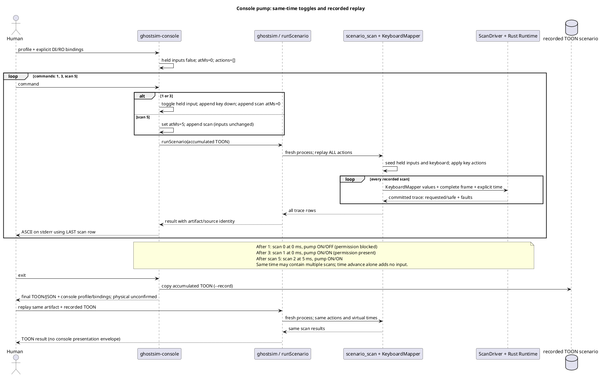
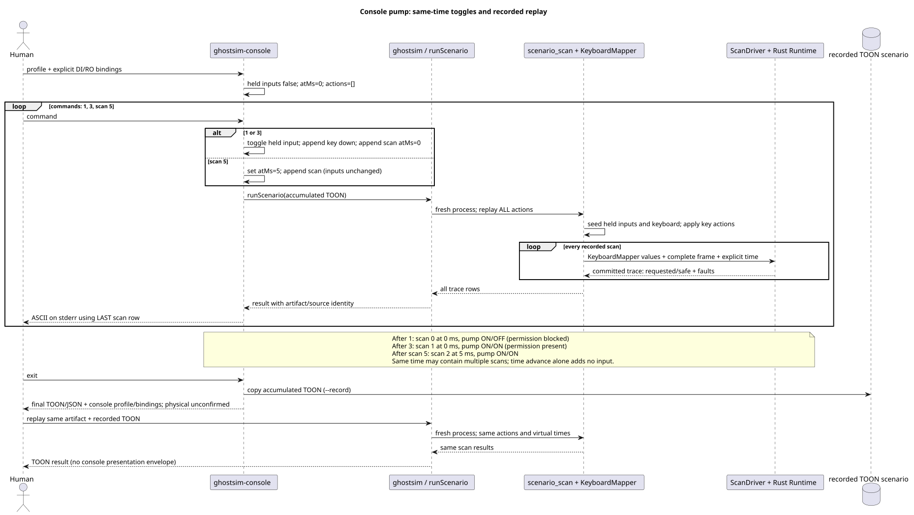
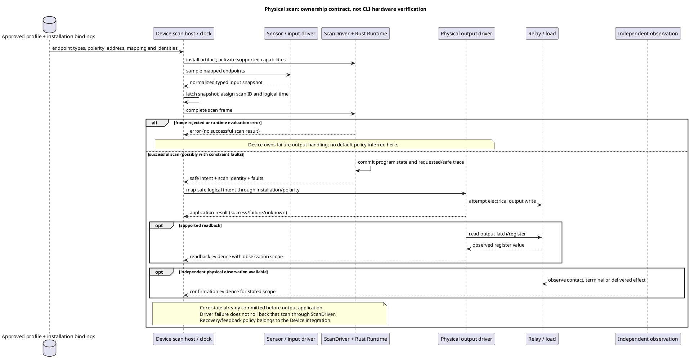
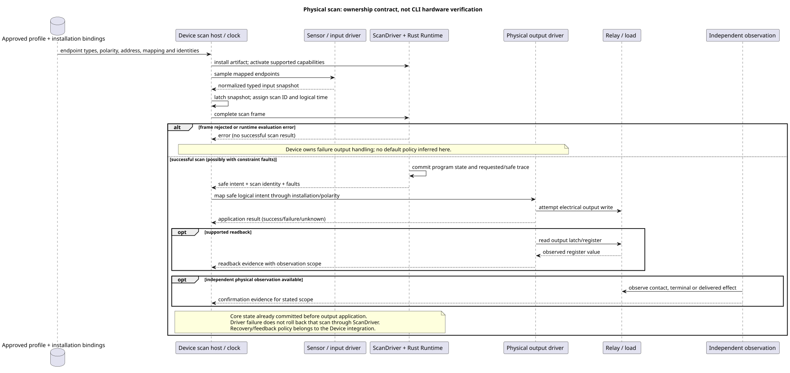

# Authoring and virtual simulation architecture

This map describes the offline toolchain at this checkout. The canonical program is
one complete `.ghost.md` document. Its prose, intent anchors, document ID, and
revision ID travel with the compiled artifact; no second editable control string
is created. The [Language Reference](LANGUAGE-REFERENCE.md) defines program
semantics. This document describes the current tools and their boundaries.



The model path uses strict TOON for [Reference queries](../tools/reference-query.mjs),
[`GhostFlow/cli-request-v1` and `cli-result-v1`](../tools/ghostc.mjs), and
[`GhostFlow/scenario-v1` and `scenario-result-v1`](../tools/ghostsim.mjs).
`ghostc --request` returns typed diagnostics with source spans. The human
`ghostc` command accepts the document path directly and prints short text
diagnostics. The [ASCII console](KEYBOARD-HOST.md) accepts raw number keys 1–8
without Enter in a TTY; `:` enters a line command such as `scan 100`. Its
recorded TOON file is a normal scenario, and its final result adds `console`
presentation identity to the simulator result.

The source map holds the complete document and immutable document/revision
identity. `ghostsim` checks the map against the exact GFB bytes and manifest
before starting the native runner. The result names the scenario SHA-256,
bytecode SHA-256, source document SHA-256 and filename, plus document/revision
IDs when supplied. A malformed request or failed activation returns a rejected
result with no scan rows. A runtime error returns only earlier committed scans
and its action index. Both exit nonzero.

Only a `scan` action evaluates the program. Its nonnegative `atMs` is a virtual
clock value that cannot move backward. Input and key actions update held values;
a later clock-only scan evaluates them again. The Rust core produces requested
and safe **virtual intent** separately. Neither field says a relay moved.
The Node host uses a private JSON transport to the native Rust process; JSON
there is an internal bridge, not a second program or public scenario format.
The console accumulates one TOON scenario and replays it through the same
`runScenario` path for each redraw. It does not own a VM or clock.

The selected [`GhostFlow/board-profile-v1`](KEYBOARD-HOST.md) or presentation-only
Driver descriptor supplies the console's ordered input and output channel
roster. `--bind CHANNEL=port` connects each channel to a matching manifest
logical port; board profiles never infer a logical binding from an endpoint
name. With no descriptor, the console uses a **virtual Waveshare 8DI/8RO**
layout. Only exact matching default `DI`/`RO` logical names bind automatically.
The layout does not verify pins, an installed board, an installation mapping,
or an applied output. Other channel counts come from the chosen descriptor.
The result records its profile ID, revision when present, digest, bindings, and
`physical: unconfirmed`.

The [browser-safe public toolchain](../tools/browser-toolchain.mjs) and
[WASM adapter](../runtimes/wasm/README.md) form a separate host path to the
same portable language/runtime semantics. The
API host owns model requests, conversation, document storage and deployment
orchestration. The Device repository owns board profiles, firmware, actual
drivers, pins, clocks and physical verification. This CLI makes no model calls
and no device calls.

## Driver, runtime and virtual device responsibilities

The following components are implemented in the offline path. The word
**Driver** needs a qualifier: an input adapter, the core `ScanDriver`, a console
descriptor and a physical I/O driver have different responsibilities.

| Component | Responsibility and state | Implementation |
| --- | --- | --- |
| Scenario / keyboard input driver | Holds typed logical inputs and key down/up state; converts explicit actions into a complete input snapshot. It never derives new sensor values from outputs. | [`scenario_scan.rs`](../crates/ghostflow-core/examples/scenario_scan.rs), [`KeyboardMapper`](../crates/ghostflow-core/src/keyboard.rs) |
| Virtual-time host | Supplies `atMs` and explicit scan opportunities. The console's toggle command appends an input/key action and a scan at the current time; `scan N` advances to the supplied time. No background clock advances this CLI session. | [`ghostsim.mjs`](../tools/ghostsim.mjs), [`ghostsim-console.mjs`](../tools/ghostsim-console.mjs) |
| Framed scan driver | Owns one runtime and validates complete typed inputs, sequential scan IDs and nondecreasing logical time before evaluation. Successful scans advance its sequence/time. It performs no device I/O. | [`ScanDriver`](../crates/ghostflow-core/src/scan.rs) |
| Portable Rust runtime | Loads GFB, activates supported capabilities, evaluates expressions, program state, timers and constraints, and emits a trace with requested/safe intents and faults. Native and WASM hosts use this core. | [`ghostflow-core`](../crates/ghostflow-core/src/lib.rs), [WASM adapter](../runtimes/wasm/README.md) |
| Virtual device view | Displays held inputs, requested/safe output banks and scan identity using the selected channel roster. The state consists of simulated input values, core program state and recorded observations; it has no separate actuator or plant model. | [ASCII panel and profile rules](KEYBOARD-HOST.md) |
| Profile / Driver descriptor | Describes ordered channels and types; explicit bindings connect them to manifest ports. Board-profile driver/address/polarity metadata is not executed by the console. | [`board-profile-v1` contract](../contracts/integration-v1/README.md), [`console-profile-v1`](KEYBOARD-HOST.md) |

“Virtual device” here means an I/O view around a real GhostFlow runtime. The
native runner registers virtual actuator capabilities from the module's output
types so the runtime can activate. It does not emulate a Waveshare controller,
relay register, contact, pump, tank level or sensor response. In particular,
`safe.pump = true` does not automatically change a water-level input. A scenario
must supply that input explicitly. A closed-loop plant model or simulated
applied/confirmed output would require a separate, explicit model and evidence
contract; neither is implemented by this CLI.

The browser has its own input and pacing host. Farm Studio's
`app/src/features/playground/playgroundRuntime.ts` instantiates
`ControlRuntime.instantiateFramed`; `playgroundScan.ts` supplies manifest-shaped
Boolean snapshots and explicit logical time, then reads displayed outputs from
the returned safe bank. `simulationPacer.ts` determines scan opportunities for
interactive playback. These frontend components do not evaluate GhostFlow
rules. Browser runtime state persists between scans, whereas the ASCII console
reconstructs the current state by replaying its accumulated scenario in a fresh
native process. Neither browser pacing nor the older real-time Rust keyboard
example changes the CLI's explicit virtual-time contract.

## Representative execution sequences

### Compile, start, and reach a virtual timer boundary

This implemented path uses the complete
[`virtual-timer.ghost.md`](../examples/authoring/corpus/virtual-timer.ghost.md)
and its [scenario](../examples/authoring/corpus/virtual-timer-scenario.toon).
`phase` starts at `Idle`; `pump` follows the computed next phase. No wall-clock
waiting occurs between the three scans. The phase names below describe the
source semantics; the trace also contains compiler-generated timer state.





Validation or activation failure yields no scan rows. An action-level runtime
error stops execution and returns earlier committed rows with its action index.
A constraint fault can instead be a successful scan with a blocked safe intent;
it is not automatically a runner failure. These paths are implemented in
[`ghostsim.mjs`](../tools/ghostsim.mjs),
[`scenario_scan.rs`](../crates/ghostflow-core/examples/scenario_scan.rs), and
[`ScanDriver`](../crates/ghostflow-core/src/scan.rs).

### Toggle an input, inspect permission blocking, then replay

This is the console command sequence in the reproduction section below, using
`pump-rev-2.ghost.md` and explicit DI/RO bindings. This pump has no program state
or timer. The console owns the accumulated scenario; each `runScenario` call
creates a fresh Rust process that reconstructs runtime state from the beginning.





Recording retains logical input/key actions and virtual scan times. The
profile digest and DI/RO binding roster are added to the final console result,
not to the scenario file. Replaying the recording reproduces logical scans;
reproducing the panel also requires retaining its profile and binding arguments.

## Physical Driver and Device boundary

The physical path has additional responsibilities defined by
[Reference §8](reference/08-language-runtime-and-device-boundaries.md) and the
[integration contract](../contracts/integration-v1/README.md):





This diagram is an ownership contract, not a connection made by `ghostsim`.
Device owns firmware, physical drivers, approved board profiles, clocks,
watchdogs and output handling at boot or failure. Installation bindings select
the actual endpoint for each logical port. Logical safe intent, driver-applied
output, register readback and physical confirmation remain distinct evidence.
The integration validator checks supplied identities and mappings; it neither
installs them nor performs I/O.

Device adapter code exists separately in `farm-device`:
`rust/ghostflow-adapter/src/lib.rs` uses the shared `ScanDriver` and records
applied masks and relay latch observations through `record_relay`; the firmware
owns the actual output operation. That separate implementation is not invoked
or certified by this authoring path. Its firmware/core revision, installation
mapping and physical evidence must be checked for the intended deployment.
There is no end-to-end device deployment, hardware emulation or physical
confirmation step in the commands below.

## What the sequences establish and leave open

The offline ownership chain is coherent: hosts supply inputs and time, the Rust
core owns evaluation and state, and views consume traces. The sequences do not
establish that a deployment is complete. The following are review findings,
with severity relative to the scenario that needs the missing behavior.

| Finding | Consequence and severity | Required evidence or decision |
| --- | --- | --- |
| Core commit precedes physical output application. `ScanDriver` exposes no output-acknowledgement transaction. | **High for physical deployment:** a write failure can leave logical state ahead of the actual actuator. This ordering is not itself a runtime defect. | Device integration must define failure/recovery and feedback behavior, then exercise a failed write and subsequent scan. This CLI cannot establish that policy. |
| No output-to-sensor plant model exists in the CLI. | **High for closed-loop claims:** safe pump intent cannot establish water flow, level change or sensor feedback. | Supply explicit scenario inputs or a separately specified plant model; independently observe physical effects for hardware claims. |
| Console redraw replays the entire accumulated scenario; the scenario is bounded to 256 scans. | **Medium for interactive duration:** this is a bounded review session, not a continuous device host. | Keep acceptance scoped to bounded sessions. A persistent session would need its own lifecycle contract before implementation. |
| A console recording omits its presentation profile/bindings; those exist in the final result. | **Low for logical replay; medium for panel reproduction:** the recorded logical scans are reproducible, but the original channel labels/layout cannot be recovered from TOON alone. | Retain the final console result and profile/binding arguments alongside the recording when panel identity matters. |

The pump permission sequence checks requested versus safe intent. The timer
sequence checks previous/next program state and the 1999/2000 ms boundary.
Neither proves a physical deadline: if a host supplies no scan at 2000 ms,
the runtime performs no autonomous transition then. Actual scan cadence,
input freshness and output latency remain host/Device acceptance criteria.
The Device-side debug/output policy is tracked in
[farm-device #25](https://github.com/callin2/farm-device/issues/25); physical
relay contact evidence is tracked in
[farm-device #26](https://github.com/callin2/farm-device/issues/26).

## Reproduce the public path

From the language repository root, with dependencies installed and the native
`scenario_scan` example built, run these commands. They use the reviewed sample
document and its TOON requests; no raw control copy is generated.

```sh
mkdir -p build/authoring
cp examples/authoring/pump-rev-2.ghost.md build/authoring/pump.ghost.md
node tools/ghostc.mjs --request examples/authoring/check-rev-2.toon
node tools/ghostc.mjs --request examples/authoring/compile-rev-2.toon
node tools/ghostsim.mjs build/authoring/pump.gfb examples/authoring/pump-scenario.toon --format toon
printf '1\n3\nscan 5\nexit\n' | node tools/ghostsim-console.mjs build/authoring/pump.gfb \
  --bind DI1=start --bind DI2=stop --bind DI3=permit_ok \
  --bind RO1=pump --bind RO2=permit --record build/authoring/console.toon --format json
node tools/ghostsim.mjs build/authoring/pump.gfb build/authoring/console.toon --format toon
```

The check and compile results identify document `GF-EXAMPLE-PUMP`, revision
`rev-2`, and the same full-document SHA-256. The scripted scenario scans at
0, 1 and 2 ms; `pump` requested/safe values are `ON/OFF`, `ON/ON`, then
`OFF/OFF`. The console example scans at 0, 0 and 5 ms. Its panel has eight
input/output rows, including unbound DI8/RO8, and reports physical status as
unconfirmed. Its recorded scenario replays with the same scans and artifact
identity. A selected 2DI/4RO board-profile fixture exercises unequal rows in
[`ghostsim-console.test.mjs`](../tests/ghostsim-console.test.mjs). The
[`authoring-workflow.test.mjs`](../tests/authoring-workflow.test.mjs) already
checks the TOON check/compile/simulate path; no separate compiler or runner is
needed for this view.

## Current limits

The runner permits at most 256 KiB of scenario text, 1,024 actions, 256 scans,
and 1 MiB of encoded result. It uses plain runtime activation. Controls that
need external certified intervals, schedule bindings, or another host resource
are rejected at activation. Host event ordering is tracked in
[#115](https://github.com/callin2/ghostflow-language/issues/115), while
temporal resources are described in [TEMPORAL-RESOURCES.md](TEMPORAL-RESOURCES.md);
basic virtual-time simulation does not supply a hidden default policy. The
console has no automatic scan cadence and does not prove physical behavior.
